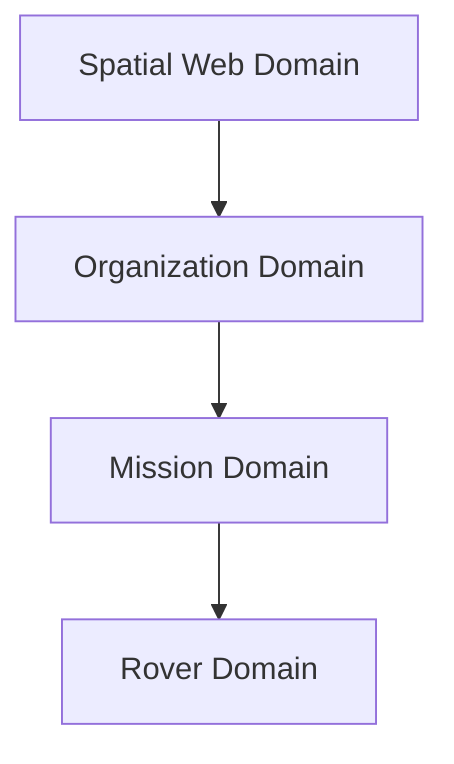
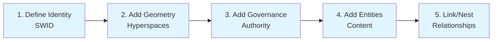
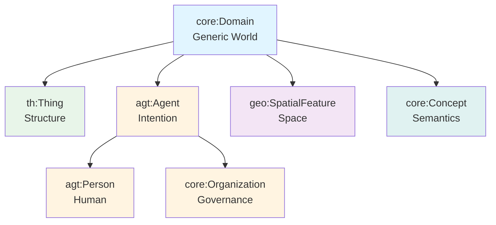

# Domains — Spheres of Influence and Context

> **"A Domain is not a database or a container. It is a sphere of influence — a living world that defines how meaning, governance, and geometry hold together."**


## Learning Objectives

After reading this guide, you should be able to:

* Understand what a **Domain** is and why it is central to HSML
* Identify when something qualifies as a Domain and when it does not
* Model a Domain using HSML constructs (SWID, Hyperspaces, Entities, Governance)
* Recognize the 6 current Domain Types in HSML and when to use each
* Apply best practices for designing interoperable, holonic worlds


## Introduction — What Is a Domain and Why It Matters

A **Domain** is the most fundamental **holon** in HSML — a *self-contained world* that exists within larger worlds and can host smaller ones.

It represents a **sphere of influence** where:

* Rules of governance apply
* Meaning is coherent
* Geometry is shared
* Relationships are internally consistent

Each Domain is autonomous, identified by a **SWID (Spatial Web Identifier)** conformant with W3C DID Core, and structured by **Hyperspaces** that define its geometry — space, time, semantics, and topology.

> *Domains are the worlds that give data, agents, and things their meaning.*

Domains make the Spatial Web possible by providing **contextual boundaries**. They separate meaning systems (contexts) while allowing **alignment and linking** across them.

In HSML, **every Domain is a holon**—a unit that is simultaneously a **whole** (with its own identity, governance, and structure) and a **part** (of larger Domains). This creates a **holarchy**—a hierarchy where each level is both autonomous and interdependent.


## Identification Criteria — How to Recognize a Domain

Use these criteria to decide if something should be modeled as a Domain.

**1. Sphere of Influence**
Does it govern or coordinate multiple entities, processes, or spaces?

> If yes → It's likely a Domain.

**2. Context Provider**
Does it define its own reference frames or semantic rules?

> If yes → It's a Domain.

**3. Autonomy & Identity**
Does it need its own SWID or governance structure?

> If yes → It's a Domain.

**4. Nested Potential**
Can it contain other holons (things, agents, sub-domains)?

> If yes → It's definitely a Domain.

**5. Coherence**
Would removing it break the contextual integrity of the system?

> If yes → It's a Domain.

**Rule of Thumb**

> *If it behaves like a world — with its own rules, geometry, and meaning — model it as a Domain.*


## Examples of Domains

### Example 1 — A Lunar Mission

A mission is a **Domain** because it governs assets, agents, and processes across multiple spaces and times.

* **Sphere of influence:** lunar operations
* **Governance:** Mission Control
* **Geometry:** lunar spatial and temporal frames
* **SWID:** `did:swf:mission:artemis`

### Example 2 — A Smart City

A city is a **Domain** governing sensors, agents, infrastructures, and citizens. It defines geographic boundaries, semantic ontologies, and policies.

### Example 3 — An Organization

An organization is a **Domain** composed of roles, agents, and resources. It defines its own policies, roles, and responsibilities.



> *Each Domain is a world — nested within the greater Web of Worlds.*


## Recipes — Modeling a Domain in HSML

Here are progressive modeling examples — from minimal to full holonic Domain.


### Recipe 1 — Minimal Domain Definition

Every Domain must have an **identity (SWID)**, **governance**, and at least one **Hyperspace**.

```turtle
@prefix core: <https://w3id.org/hsml/core#> .
@prefix hspace: <https://w3id.org/hsml/hspace#> .

:MissionDomain a core:Domain ;
    core:swid "did:swf:mission:v1" ;
    core:governedBy :MissionAgency ;
    hspace:hasHyperspace :MissionSpace .
```


### Recipe 2 — Domain with Geometry and Context

Add **spatial** and **temporal** structure to define the world's geometry.

```turtle
@prefix core: <https://w3id.org/hsml/core#> .
@prefix hspace: <https://w3id.org/hsml/hspace#> .
@prefix hvec: <https://w3id.org/hsml/hspace/vector#> .
@prefix htime: <https://w3id.org/hsml/hspace/temporal#> .

:MissionDomain a core:Domain ;
    core:swid "did:swf:mission:artemis" ;
    core:governedBy :MissionAgency ;
    hspace:hasHyperspace :LunarSpace , :MissionTime .

:LunarSpace a hvec:VectorSpace ;
    hspace:hasFrame :LunarFrame .

:MissionTime a htime:TemporalSpace ;
    hspace:hasFrame :MissionUTC .
```


### Recipe 3 — Domain with Entities and Sub-Domains

Define **Entities** living inside and **Sub-Domains** nested within.

```turtle
@prefix core: <https://w3id.org/hsml/core#> .
@prefix hspace: <https://w3id.org/hsml/hspace#> .
@prefix hvec: <https://w3id.org/hsml/hspace/vector#> .
@prefix th: <https://w3id.org/hsml/thing#> .

:RoverDomain a core:Domain ;
    core:swid "did:swf:rover:viper" ;
    core:domainType th:Thing ;
    core:governedBy :MissionDomain ;
    hspace:hasHyperspace :RoverSpace .

:RoverSpace a hvec:VectorSpace ;
    hspace:hasFrame :LocalFrame .

# Rover has observable properties and capabilities
:RoverDomain th:hasObservableProperty th:BatteryLevel ;
    th:hasCapability th:Move .

# Nest the rover within the mission
:MissionDomain core:containsDomain :RoverDomain .
```


### Recipe 4 — Linking Peer Domains

Domains link through shared geometry, semantics, or policy.

```turtle
@prefix core: <https://w3id.org/hsml/core#> .
@prefix hspace: <https://w3id.org/hsml/hspace#> .

:LunarDomain core:linkedTo :EarthDomain ;
    hspace:alignedWith :WGS84 ;
    core:sharedPolicy :InterAgencyAgreement .
```

> *Domains cooperate through links — not by merging.*


## Domain Modeling Pipeline

The process of modeling a Domain follows a clear progression:



**Step-by-step:**

1. **Define Identity** → Assign a `core:swid` (Spatial Web Identifier)
2. **Add Geometry** → Define `hspace:hasHyperspace` (spatial, temporal, semantic)
3. **Add Governance** → Specify `core:governedBy` (Domain Authority)
4. **Add Entities** → Populate with Entities, Things, Agents, etc.
5. **Link/Nest Domains** → Use `core:linkedTo` and `core:containsDomain`


## Best Practices for Domain Modeling

### Do

* Always give each Domain a **SWID** (`core:swid`)
* Define at least one **Hyperspace** (space, time, or semantics)
* Attach a **governance agent or organization** (`core:governedBy`)
* Use **sub-domains** to structure complexity
* Link Domains with explicit contracts or frame alignments
* Use the most specific **Domain Type** that fits your use case

### Don't

* Model transient flows (Activities, Channels) as Domains
* Omit identity — every Domain must be uniquely addressable
* Duplicate Hyperspaces unnecessarily — reuse shared reference frames
* Confuse governance and geometry — they serve distinct functions
* Use `core:Domain` directly unless you truly need a generic world

> *Keep Domains modular and coherent — small worlds that align through shared geometry.*


## Takeaways — Understanding Domains

### Key Takeaways

* A **Domain** is a **sphere of influence and context** — a holon that defines its own meaning, governance, and geometry
* It has a **SWID**, **governing authority**, and **Hyperspaces** that define its structure
* It can **contain** other Domains (holonic nesting) or **link** to peers (web of worlds)
* To model anything as a Domain, ask: *Does it define a coherent world of meaning and influence?*
* Domains are the **primary unit of reality in HSML** — the building blocks of the Spatial Web


## Domain Types — Specialized Worlds

While all Domains share the same holonic architecture, **Domain Types** specialize the generic `core:Domain` to represent different **kinds of worlds**:

| Aspect | Purpose | Domain Type |
|--||-|
| **Structure** | Physical or digital artifacts with measurable properties | `th:Thing` |
| **Intention** | Autonomous entities that can act and decide | `agt:Agent` |
| **Person** | Human individuals with self-sovereign identity | `agt:Person` |
| **Governance** | Systems that coordinate and control other Domains | `core:Organization` |
| **Space** | Location-bound or geometry-bearing entities | `geo:SpatialFeature` |
| **Meaning** | Semantic worlds of concepts and classification | `core:Concept` |

> **Key Insight:** Domain Types can be combined to model complex systems. For example, an `Organization` (which is a type of `Agent`) can contain `Person` agents and coordinate `Thing` resources within a `SpatialFeature` context.


## The Domain Type Hierarchy

All Domain Types inherit from `core:Domain`, which provides:

* **Identity** (`core:swid`) — DID-based addressability
* **Governance** (`core:governedBy`) — Authority and policies
* **Structure** (`hspace:hasHyperspace`) — Spatial and contextual relationships
* **Containment** (`core:containsDomain`) — Holonic hierarchy
* **Linkage** (`core:linkedTo`) — Relationships with other Domains




## Domain Type Catalog

### `core:Domain` — The Generic World

**Type:** Base class for all worlds  
**Namespace:** `https://w3id.org/hsml/core#`  
**Purpose:** Foundational class that all Domain Types inherit from

**Definition:**

```turtle
@prefix core: <https://w3id.org/hsml/core#> .
@prefix owl: <http://www.w3.org/2002/07/owl#> .
@prefix rdfs: <http://www.w3.org/2000/01/rdf-schema#> .

core:Domain a owl:Class ;
    rdfs:comment "A holon that defines a sphere of influence, governance, and geometry." .
```

**When to use:**

* Directly: Rare—usually you'll use a specialized type
* Indirectly: Always—all Domain Types inherit from this

**Inherited Properties:**

* `core:swid` — Spatial Web Identifier (mandatory)
* `core:governedBy` — Domain Authority
* `hspace:hasHyperspace` — Associated Hyperspaces
* `core:containsDomain` — Child Domains
* `core:linkedTo` — Related Domains


### `th:Thing` — Structural / Physical Domains

**Type:** World of *structure and state*  
**Namespace:** `https://w3id.org/hsml/thing#`  
**Purpose:** Represents tangible or digital artifacts with observable properties and behavior

**Definition:**

```turtle
@prefix th: <https://w3id.org/hsml/thing#> .
@prefix core: <https://w3id.org/hsml/core#> .
@prefix rdfs: <http://www.w3.org/2000/01/rdf-schema#> .

th:Thing rdfs:subClassOf core:Domain ;
    rdfs:comment "A Domain representing a physical or digital artifact with observable properties and capabilities." .
```

**When to use:**

Use `th:Thing` for:
* Physical objects (rovers, sensors, vehicles, instruments)
* Digital assets (datasets, digital twins, services)
* Entities with measurable properties and behavior
* Objects that can be sensed, acted upon, or controlled

**Examples:**

```turtle
@prefix th: <https://w3id.org/hsml/thing#> .
@prefix core: <https://w3id.org/hsml/core#> .
@prefix schema: <https://schema.org/> .

<urn:swid:mars-rover-001> a th:Thing ;
    core:swid "did:swf:mars-rover-001:v1" ;
    schema:name "Mars Exploration Rover" ;
    schema:description "Autonomous rover for surface exploration" .
```

> **Takeaway:** Things are the worlds of structure and behavior—the physical and digital artifacts that populate the Spatial Web.


### `agt:Agent` — Domains of Intention and Action

**Type:** World of *autonomy and decision-making*  
**Namespace:** `https://w3id.org/hsml/agent#`  
**Purpose:** Represents entities capable of autonomous or delegated action

**Definition:**

```turtle
@prefix agt: <https://w3id.org/hsml/agent#> .
@prefix core: <https://w3id.org/hsml/core#> .
@prefix rdfs: <http://www.w3.org/2000/01/rdf-schema#> .

agt:Agent rdfs:subClassOf core:Domain ;
    rdfs:comment "A Domain capable of autonomous or delegated action within or across other domains." .
```

**When to use:**

Use `agt:Agent` for:
* AI systems or autonomous controllers
* Automated processes or workflows
* Entities that can make decisions and take actions
* Digital twin agents
* Non-human autonomous entities

**Examples:**

```turtle
@prefix agt: <https://w3id.org/hsml/agent#> .
@prefix core: <https://w3id.org/hsml/core#> .
@prefix schema: <https://schema.org/> .

<urn:swid:mission-control-agent> a agt:Agent ;
    core:swid "did:swf:mission-control:v1" ;
    schema:name "Mission Control System" ;
    schema:description "AI agent coordinating autonomous operations" .
```

> **Takeaway:** Agents are living worlds of intention and choice—they act, decide, and interact with other Domains.


### `agt:Person` — Human Individuals

**Type:** Special type of Agent for *human individuals*  
**Namespace:** `https://w3id.org/hsml/agent#`  
**Purpose:** Represents human persons with self-sovereign identity

**Definition:**

```turtle
@prefix agt: <https://w3id.org/hsml/agent#> .
@prefix core: <https://w3id.org/hsml/core#> .
@prefix rdfs: <http://www.w3.org/2000/01/rdf-schema#> .

agt:Person rdfs:subClassOf agt:Agent ;
    rdfs:comment "A human individual in the Spatial Web with self-sovereign identity." .
```

**When to use:**

Use `agt:Person` for:
* Human operators, users, or participants
* Individual people who need self-sovereign identity
* Human agents in the system

**Examples:**

```turtle
@prefix agt: <https://w3id.org/hsml/agent#> .
@prefix core: <https://w3id.org/hsml/core#> .
@prefix schema: <https://schema.org/> .

<urn:swid:operator-001> a agt:Person ;
    core:swid "did:swf:operator-001:v1" ;
    schema:name "Dr. Sarah Chen" ;
    schema:description "Mission operator with self-sovereign identity" .
```

> **Takeaway:** Persons are human agents with self-sovereign identity—they maintain ultimate control over their digital presence and credentials.


### `core:Organization` — Governance Worlds

**Type:** World of *roles, authority, and coordination*  
**Namespace:** `https://w3id.org/hsml/core#`  
**Purpose:** Represents systems of governance, coordination, and shared purpose

**Definition:**

```turtle
@prefix core: <https://w3id.org/hsml/core#> .
@prefix agt: <https://w3id.org/hsml/agent#> .
@prefix rdfs: <http://www.w3.org/2000/01/rdf-schema#> .

core:Organization rdfs:subClassOf agt:Agent ;
    rdfs:comment "A Domain representing a system of governance, coordination, and shared purpose." .
```

**When to use:**

Use `core:Organization` for:
* Space agencies, universities, companies
* Government departments or agencies
* Consortia or collaborative groups
* Any entity that governs other Domains
* Systems that define policies, roles, and collective behavior

**Examples:**

```turtle
@prefix core: <https://w3id.org/hsml/core#> .
@prefix schema: <https://schema.org/> .

<urn:swid:nasa-agency> a core:Organization ;
    core:swid "did:swf:nasa:v1" ;
    schema:name "NASA" ;
    schema:description "National Aeronautics and Space Administration" .
```

> **Takeaway:** Organizations are agents that govern other worlds—they establish rules, coordinate activities, and manage collective behavior.


### `geo:SpatialFeature` — Spatial Worlds

**Type:** World of *space and place*  
**Namespace:** `https://w3id.org/hsml/core#` (uses `geo:` prefix convention)  
**Purpose:** Represents location-bound or geometry-bearing entities

**Definition:**

```turtle
@prefix core: <https://w3id.org/hsml/core#> .
@prefix rdfs: <http://www.w3.org/2000/01/rdf-schema#> .

core:SpatialFeature rdfs:subClassOf core:Domain ;
    rdfs:comment "An entity that represents a location-bound or geometry-bearing element of the GEOGRAPHIC DOMAIN type." .
```

**When to use:**

Use `geo:SpatialFeature` (or `core:SpatialFeature`) for:
* Landmarks, boundaries, sensor sites
* Natural features (craters, mountains, rivers)
* Building footprints, routes, zones
* Any entity that is anchored in space
* Entities where position, extent, or spatial relationships are essential

**Examples:**

```turtle
@prefix core: <https://w3id.org/hsml/core#> .
@prefix geo: <https://w3id.org/hsml/core#> .
@prefix geosparql: <http://www.opengis.net/ont/geosparql#> .
@prefix schema: <https://schema.org/> .

<urn:swid:jezero-crater> a geo:SpatialFeature ;
    core:swid "did:swf:jezero-crater:v1" ;
    schema:name "Jezero Crater" ;
    schema:description "Mars landing site for Perseverance rover" ;
    geosparql:hasGeometry <urn:geometry:jezero-crater> .
```

> **Takeaway:** SpatialFeatures are the worlds that define where—they bind semantic entities to geospatial structures for reasoning and analysis.


### `core:Concept` — Semantic Worlds

**Type:** World of *meaning and classification*  
**Namespace:** `https://w3id.org/hsml/core#`  
**Purpose:** Represents conceptual or semantic worlds of meaning

**Definition:**

```turtle
@prefix core: <https://w3id.org/hsml/core#> .
@prefix rdfs: <http://www.w3.org/2000/01/rdf-schema#> .

core:Concept rdfs:subClassOf core:Domain ;
    rdfs:comment "A Domain representing a conceptual or semantic world of meaning." .
```

**When to use:**

Use `core:Concept` for:
* Conceptual categories (Mission, Observation, SensorType, RiskLevel)
* Ontological frameworks or vocabularies
* Classification systems
* Abstract ideas that organize reality
* Semantic taxonomies

**Examples:**

```turtle
@prefix core: <https://w3id.org/hsml/core#> .
@prefix schema: <https://schema.org/> .

<urn:swid:mission-concept> a core:Concept ;
    core:swid "did:swf:mission-concept:v1" ;
    schema:name "Mission" ;
    schema:description "Conceptual category for coordinated activities" .
```

> **Takeaway:** Concepts are the worlds of thought that organize reality—they provide semantic structure and classification.


## Choosing the Right Domain Type

### Decision Tree

```
Is it primarily about...
├─ Physical/digital structure? → th:Thing
├─ Autonomous action/decision?
│   ├─ Human individual? → agt:Person
│   ├─ Governance/coordination system? → core:Organization
│   └─ Other autonomous entity? → agt:Agent
├─ Spatial context/geometry? → geo:SpatialFeature
└─ Conceptual meaning? → core:Concept
```

### Common Patterns

| Pattern | Domain Types Involved | Example |
||||
| **Autonomous System** | `agt:Agent` + `th:Thing` | Robot agent with sensors and actuators |
| **Organizational Structure** | `core:Organization` + `agt:Person` | Agency with team members |
| **Spatial Context** | `geo:SpatialFeature` + `th:Thing` | Sensor site with equipment |
| **Semantic Classification** | `core:Concept` + other types | Mission concept categorizing activities |
| **Embodied Agent** | `agt:Agent` + `th:Thing` (via `agt:embodiedIn`) | Robot agent embodied in physical body |


## Summary Table

| Domain Type | Namespace | Primary Purpose | Key Use Cases |
||--|--||
| `core:Domain` | `core#` | Base class | Foundation for all types |
| `th:Thing` | `thing#` | Structure & State | Physical/digital artifacts |
| `agt:Agent` | `agent#` | Autonomy & Action | AI systems, autonomous controllers |
| `agt:Person` | `agent#` | Human Individual | Human operators, users with self-sovereign identity |
| `core:Organization` | `core#` | Governance & Coordination | Agencies, companies, groups (subclass of `agt:Agent`) |
| `geo:SpatialFeature` | `core#` | Space & Place | Landmarks, boundaries, spatial features |
| `core:Concept` | `core#` | Meaning & Classification | Ontologies, categories, vocabularies |


## In Short

> **A Domain is the stage where reality happens. It gives structure to space, meaning to entities, and coherence to the Web of Worlds.**

**HSML provides 6 Domain Types that cover the fundamental aspects of reality: structure (`th:Thing`), autonomy (`agt:Agent`, `agt:Person`, `core:Organization`), space (`geo:SpatialFeature`), and meaning (`core:Concept`).**

Domain Types provide **semantic specialization** for the generic `core:Domain`, enabling you to:

* Model different kinds of worlds with appropriate semantics
* Enable type-specific reasoning and validation
* Create clear, interoperable models
* Build complex systems through composition

All Domain Types share the same **holonic architecture** (identity, governance, geometry, context), but each adds **domain-specific meaning** that makes the Spatial Web more expressive and precise.


## Next Steps

* **[Basic Concepts](basic-concepts.md)** → Learn about Entities, SWIDs, and the holonic model
* **[Your First HSML Model](first-model.md)** → Build a simple Domain model
* **[Agents & Capabilities](../agent-module/)** → Deep dive into Agent Domains
* **[Hyperspaces](../hyperspace-module/)** → Understand spatial and contextual relationships
* **[Governance & Credentials](../governance-module/)** → Learn about Domain governance and policies


## Related Resources

* [HSML Core Module Specification](../../specification/sections/hsml_core_module/hsml_core_module.adoc)
* [Domain Class Definition](../../specification/sections/hsml_core_module/hsml_domain.adoc)
* [Holonic Graph Model](../../specification/sections/hsml_holonic_graph_model.adoc)
