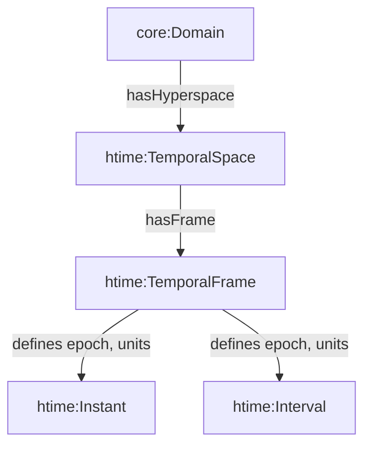

# Temporal Spaces: The Dimension of When

> *"Time is the dimension that orders events, enables causality, and gives meaning to sequence. Without temporal structure, the Spatial Web cannot reason about when things happen."*


**Learning Objectives**

After reading this guide, you should be able to:

* Understand what **TemporalSpace** is and when a Domain needs one
* Recognize that TemporalSpace is built entirely on the **W3C OWL-Time standard**
* Recognize how TemporalSpace answers the "when" question in Hyperspace structure
* Model temporal instants and intervals using standard OWL-Time properties
* Define and use TemporalFrames for different time systems (UTC, simulation time, etc.)
* Create temporal paths (Timelines) for reasoning about event sequences
* Apply temporal annotations to arrows and paths in other Hyperspaces
* Align multiple TemporalSpaces for dual-time tracking scenarios


## The Need for Temporal Structure

Many Domains in the Spatial Web need to reason about time. Events occur, processes unfold, and observations are made—all within a temporal context. For these Domains, temporal structure is essential to answer fundamental questions: When did this happen? What occurred before or after? How long did it last? Are these events simultaneous or sequential?

In the Hyperspace architecture, **TemporalSpace** provides the one-dimensional temporal dimension that complements spatial structure. Just as VectorSpace answers "where," TemporalSpace answers "when." It is a specialized Hyperspace that represents time as a navigable, queryable structure where events, processes, and observations can be positioned, ordered, and reasoned about.


**Key Concept**

A Domain needs a `htime:TemporalSpace` when you need to reason about temporal relationships—when events occur, how they're ordered, or how long processes last. TemporalSpace anchors all temporal entities—instants, intervals, and events—to a TemporalFrame that specifies the epoch, scale, and units of the time system.


## What Is a TemporalSpace?

A **TemporalSpace** is a one-dimensional Hyperspace that represents the temporal dimension of a Domain. It provides the temporal context in which events, processes, and observations occur, and defines how temporal entities (instants and intervals) are measured, ordered, and compared.

In the Hyperspace architecture, each space type captures a distinct domain of reference:

| Hyperspace Type | Example | Frame Type | Role |
|----------------|---------|------------|------|
| VectorSpace | 3D spatial coordinates | `hvec:PoseFrame` | Defines origin, orientation, and metric |
| **TemporalSpace** | Time axis (1D) | `htime:TemporalFrame` | Defines epoch, time scale, and units |
| TopologicalSpace | Network connectivity | `htopo:TopologyFrame` | Defines adjacency or neighborhood |
| GraphSpace | Semantic graphs, networks | `hgraph:GraphFrame` | Defines nodes, edges, and graph topology |

Thus, **TemporalSpace provides the temporal axis for reasoning "when" things happen**, complementing the spatial "where."

### Conceptual Model



Each Domain declares one or more TemporalSpaces. Each TemporalSpace declares at least one TemporalFrame, defining its temporal reference system. Instants and Intervals exist within those frames.

## Built on W3C OWL-Time Standard

**TemporalSpace is built entirely on the W3C OWL-Time ontology** (`http://www.w3.org/2006/time#`). HSML's temporal model reuses and extends OWL-Time, ensuring that all `htime:` classes and properties are fully compatible with their OWL-Time equivalents. This guarantees interoperability with any system that uses W3C temporal standards while situating temporal semantics within the multi-hyperspace architecture.


**Built on W3C OWL-Time Standard**

TemporalSpace relies entirely on the **W3C OWL-Time ontology** (`http://www.w3.org/2006/time#`) for its temporal semantics. All temporal elements (instants, intervals), relationships (before, after, overlaps), and reference frames are based on OWL-Time, ensuring full interoperability with W3C standards and existing temporal data.



**OWL-Time Foundation**

TemporalSpace does not reinvent temporal semantics—it builds directly on the mature, standardized W3C OWL-Time ontology. This means:
* All temporal elements (`time:Instant`, `time:Interval`) are standard OWL-Time classes
* All temporal relationships (`time:before`, `time:intervalOverlaps`, etc.) are standard OWL-Time properties
* Temporal reference frames (`time:TemporalReferenceSystem`) map directly to OWL-Time
* Any data or queries using OWL-Time can be seamlessly integrated with HSML TemporalSpace


| HSML Concept | OWL-Time Equivalent | Description |
|--------------|---------------------|-------------|
| `htime:TemporalSpace` | (new) | A Hyperspace dedicated to temporal representation |
| `htime:TemporalFrame` | `time:TemporalReferenceSystem` | Defines epoch, units, and scale (e.g., UTC, GPS, SimulationTime) |
| `htime:Instant` | `time:Instant` | A single point in time within a TemporalSpace |
| `htime:Interval` | `time:Interval` | A duration or period defined by two instants |
| `hspace:hasFrame` | ≈ `time:hasTRS` | Associates a temporal entity with its frame |
| `htime:temporalRelationship` | (subproperty of `hspace:arrowProperty`) | Specifies temporal navigation property (e.g., `time:before`) |
| `htime:temporalProperty` | (subproperty of `hspace:elementProperty`) | Specifies property for linking entities to temporal elements |

SISO-STD-018-2020 defines standard Temporal Reference Frames used in simulations (UTC, GPS, TAI, SimulationTime). These directly map to HSML's `htime:TemporalFrame`:

| SISO Frame | Epoch | HSML Mapping |
|------------|-------|--------------|
| UTC | 1970-01-01T00:00Z | `htime:TemporalFrame` (physical time) |
| GPS Time | 1980-01-06T00:00Z | `htime:TemporalFrame` |
| Simulation Time | 0.0 | `htime:TemporalFrame` (logical time) |
| Mission Elapsed Time | domain-specific | `htime:TemporalFrame` |


**Standards Interoperability**

TemporalSpace's complete reliance on W3C OWL-Time ensures full interoperability with existing temporal data, queries, and reasoning systems. SISO SRFOM temporal frames can be directly mapped to HSML TemporalFrames, and any OWL-Time compliant system can work seamlessly with HSML TemporalSpaces.


## TemporalSpace as a Hyperspace

Like all Hyperspaces, TemporalSpace follows the universal blueprint: Elements, Arrows, and Reference Frames. Understanding how these components manifest in the temporal dimension is essential for effective modeling.

### Element Types

TemporalSpace uses element types directly from the **W3C OWL-Time ontology**:

* **`time:Instant`** — A single point in time from OWL-Time. Used when you need to represent exact moments: when a sensor reading occurred, when a transaction was processed, when an event triggered.

* **`time:Interval`** — A duration or period defined by two instants from OWL-Time. Used when you need to represent spans: meeting durations, process execution times, validity windows for credentials.

* **Mixed** — A TemporalSpace can support both instants and intervals, allowing flexible modeling of both point-in-time events and extended processes.

Both `time:Instant` and `time:Interval` are standard OWL-Time classes, ensuring compatibility with any system that uses W3C temporal standards.

### Arrow Types

The arrows in TemporalSpace are temporal relationships directly from the **W3C OWL-Time ontology** (`time:` namespace):

**For Instants:**
* `time:before` — One instant occurs before another
* `time:after` — One instant occurs after another

**For Intervals:**
* `time:intervalBefore` — Interval ends before another starts
* `time:intervalAfter` — Interval starts after another ends
* `time:intervalContains` — One interval fully contains another
* `time:intervalDuring` — One interval is fully within another
* `time:intervalOverlaps` — Intervals overlap in time
* `time:intervalMeets` — One interval ends where another begins
* `time:intervalStarts` — Intervals start at the same time
* `time:intervalFinishes` — Intervals end at the same time
* `time:intervalEquals` — Intervals are identical

These relationships enable navigation and reasoning: finding events before or after a given time, discovering overlapping intervals, or constructing temporal sequences.

### Temporal-Specific Properties

TemporalSpace defines two specialized properties that provide domain-specific semantics for temporal modeling:

**`htime:temporalRelationship`** — A subproperty of `hspace:arrowProperty` that specifies the temporal relationship property (from OWL-Time) used for navigation between temporal elements. This property is restricted to TemporalSpace and makes the temporal navigation semantics explicit.

**`htime:temporalProperty`** — A subproperty of `hspace:elementProperty` (or `hspace:spatialProperty`) that specifies the RDF property used to link entities to temporal elements (instants or intervals) in this TemporalSpace. This is particularly useful for dual-time tracking scenarios where entities need to link to multiple TemporalSpaces using different properties.

```turtle
htime:temporalRelationship a owl:ObjectProperty ;
    rdfs:subPropertyOf hspace:arrowProperty ;
    rdfs:domain htime:TemporalSpace ;
    rdfs:range owl:ObjectProperty ;
    rdfs:comment "Specifies the temporal relationship property (from OWL-Time) used for navigation between temporal elements in this TemporalSpace." .

htime:temporalProperty a owl:ObjectProperty ;
    rdfs:subPropertyOf hspace:elementProperty ;
    rdfs:domain htime:TemporalSpace ;
    rdfs:range owl:ObjectProperty ;
    rdfs:comment "Specifies the RDF property used to link entities to temporal elements (instants or intervals) in this TemporalSpace." .
```

### Path Types

Paths in TemporalSpace represent composed temporal sequences. The primary path type is **`htime:Timeline`**, which is the temporal equivalent of a spatial trajectory. Just as a trajectory represents a path through spatial coordinates, a Timeline represents a path through temporal coordinates.

| Concept | Spatial (VectorSpace) | Temporal (TemporalSpace) |
|---------|----------------------|-------------------------|
| **Path Type** | `hvec:Trajectory` | `htime:Timeline` |
| **Elements** | Spatial points/positions | Temporal instants/intervals |
| **Navigation** | Spatial relationships | Temporal relationships (`time:before`, etc.) |
| **Purpose** | Path through space | Path through time |

Timelines enable reasoning about chronological sequences: project milestones, workflow steps, event chains, or any ordered progression through time.

## Modeling TemporalSpace

To model a TemporalSpace, you need to define its element type, arrow types, temporal relationship property, temporal property (for linking entities to temporal elements), and most importantly, its TemporalFrame. The TemporalFrame specifies the epoch (starting point), time scale, and units that make temporal values meaningful.

### Basic Structure

```turtle
@prefix core: <https://www.spatialwebfoundation.org/ns/hsml/core#> .
@prefix hspace: <https://www.spatialwebfoundation.org/ns/hsml/hspace#> .
@prefix htime: <https://www.spatialwebfoundation.org/ns/hsml/hspace/temporal#> .
@prefix time: <http://www.w3.org/2006/time#> .
@prefix schema: <https://schema.org/> .
@prefix xsd: <http://www.w3.org/2001/XMLSchema#> .

<https://example.org/swid/physical-time-space> a htime:TemporalSpace ;
    core:swid "did:swf:physical-time-space:v1" ;
    hspace:hasElementType time:Instant ;
    hspace:hasArrowType time:before, time:after, time:intervalBefore, time:intervalAfter ;
    htime:temporalRelationship time:before ;
    htime:temporalProperty htime:hasPhysicalTime ;
    hspace:hasFrame <https://example.org/frame/utc> .

<https://example.org/frame/utc> a htime:TemporalFrame, time:TemporalReferenceSystem ;
    schema:name "Coordinated Universal Time (UTC)" ;
    schema:description "UTC temporal reference frame with Unix epoch (1970-01-01T00:00:00Z) and seconds as the unit" .
```

The TemporalFrame defines the reference system—in this case, UTC with the Unix epoch (1970-01-01T00:00:00Z) and seconds as the unit. All temporal instants and intervals using this frame will be interpreted according to these specifications.

## Types of Temporal Spaces

Different use cases require different temporal reference systems. HSML supports multiple TemporalSpaces within a single Domain, each with its own frame.

### Physical Time: UTC and Real-World Time

For events that need to align with real-world time—sensor readings, system logs, transaction timestamps—use UTC (Coordinated Universal Time). This is the standard for physical time tracking.

```turtle
<https://example.org/frame/utc> a htime:TemporalFrame, time:TemporalReferenceSystem ;
    schema:name "Coordinated Universal Time (UTC)" ;
    schema:description "UTC temporal reference frame with Unix epoch (1970-01-01T00:00:00Z) and seconds as the unit" .
```

Instants in UTC use calendar dates and times:

```turtle
<https://example.org/instant/launch> a time:Instant ;
    time:inXSDDateTimeStamp "2025-11-04T13:30:00Z"^^xsd:dateTimeStamp ;
    time:hasTRS <https://example.org/frame/utc> .
```

### Logical Time: Simulation and Virtual Environments

For simulations, game engines, or virtual environments where time advances according to a logical clock independent of real-world time, use simulation time. This uses numeric positions (ticks, steps, or simulation units) rather than calendar dates.

```turtle
<https://example.org/frame/simulation-time> a htime:TemporalFrame, time:TemporalReferenceSystem ;
    schema:name "Simulation Logical Time" ;
    schema:description "Logical time system advancing according to the simulation clock with epoch 0.0 and seconds as the unit. May be scaled or offset relative to real-world time." .
```

Instants in simulation time use numeric positions:

```turtle
<https://example.org/instant/tick123> a time:Instant ;
    time:numericPosition "123.0"^^xsd:double ;
    time:hasTRS <https://example.org/frame/simulation-time> .
```

### Dual-Time Tracking

Many systems need both physical and logical time simultaneously. Digital twins, hybrid simulations, or systems that correlate simulation events with real-world timestamps require multiple TemporalSpaces.

```turtle
@prefix core: <https://www.spatialwebfoundation.org/ns/hsml/core#> .
@prefix hspace: <https://www.spatialwebfoundation.org/ns/hsml/hspace#> .
@prefix htime: <https://www.spatialwebfoundation.org/ns/hsml/hspace/temporal#> .

<https://example.org/swid/simulation-domain> a core:Domain ;
    core:swid "did:swf:simulation-domain:v1" ;
    hspace:hasHyperspace <https://example.org/swid/physical-time-space>, <https://example.org/swid/simulation-time-space> .
```

Each TemporalSpace defines its `htime:temporalProperty` to specify which property entities should use to link to temporal elements:

```turtle
<https://example.org/swid/physical-time-space> a htime:TemporalSpace ;
    core:swid "did:swf:physical-time-space:v1" ;
    hspace:hasElementType time:Instant ;
    htime:temporalRelationship time:before ;
    htime:temporalProperty htime:hasPhysicalTime ;
    hspace:hasFrame <https://example.org/frame/utc> .

<https://example.org/swid/simulation-time-space> a htime:TemporalSpace ;
    core:swid "did:swf:simulation-time-space:v1" ;
    hspace:hasElementType time:Instant ;
    htime:temporalRelationship time:before ;
    htime:temporalProperty htime:hasSimulationTime ;
    hspace:hasFrame <https://example.org/frame/simulation-time> .
```

Events can then carry both timestamps using the properties defined by each TemporalSpace:

```turtle
<https://example.org/event/sensor-reading-123> a ex:Event ;
    htime:hasPhysicalTime [ a time:Instant ;
                           time:inXSDDateTimeStamp "2025-11-04T13:30:00Z"^^xsd:dateTimeStamp ;
                           time:hasTRS <https://example.org/frame/utc> ] ;
    htime:hasSimulationTime [ a time:Instant ;
                              time:numericPosition "456.0"^^xsd:double ;
                              time:hasTRS <https://example.org/frame/simulation-time> ] .
```

This enables querying by real-world time for external integration, querying by simulation time for logical consistency, and correlating simulation steps with physical timestamps for debugging and replay.


**Using temporalProperty for Dual-Time Tracking**

The `htime:temporalProperty` on each TemporalSpace specifies which property entities should use to link to temporal elements. This is essential for dual-time tracking:
* Physical time TemporalSpace → `htime:temporalProperty htime:hasPhysicalTime`
* Simulation time TemporalSpace → `htime:temporalProperty htime:hasSimulationTime`

Entities can then use these properties to link to instants/intervals in the appropriate TemporalSpace, enabling clear separation and querying of different time systems.



**Best Practice**

Model simulation or mission clocks as separate TemporalSpaces. Each distinct time system (UTC, SimulationTime, Mission Elapsed Time) deserves its own frame. This allows clear separation of concerns and explicit alignment when needed.


## Representing Temporal Elements

Temporal entities can be represented as Instant or Interval instances, or as literal properties on an Entity living in a domain with temporal spaces. The choice depends on whether you need to reason about temporal relationships or simply annotate entities with timestamps.

### Time Instants

An instant represents a single point in time. Use `time:inXSDDateTimeStamp` for calendar-based times (UTC) or `time:numericPosition` for logical times (simulation):

```turtle
@prefix htime: <https://www.spatialwebfoundation.org/ns/hsml/hspace/temporal#> .
@prefix time: <http://www.w3.org/2006/time#> .
@prefix xsd: <http://www.w3.org/2001/XMLSchema#> .

<https://example.org/instant/2025-01-15T10:00:00Z> a time:Instant ;
    time:inXSDDateTimeStamp "2025-01-15T10:00:00Z"^^xsd:dateTimeStamp ;
    time:hasTRS <https://example.org/frame/utc> .
```

### Time Intervals

An interval represents a duration or period defined by two instants:

```turtle
<https://example.org/interval/meeting-001> a time:Interval ;
    time:hasBeginning [ a time:Instant ;
                       time:inXSDDateTimeStamp "2025-01-15T10:00:00Z"^^xsd:dateTimeStamp ;
                       time:hasTRS <https://example.org/frame/utc> ] ;
    time:hasEnd [ a time:Instant ;
                 time:inXSDDateTimeStamp "2025-01-15T11:00:00Z"^^xsd:dateTimeStamp ;
                 time:hasTRS <https://example.org/frame/utc> ] .
```

Intervals enable reasoning about durations, overlaps, and containment relationships.

## Temporal Navigation

The arrows in TemporalSpace enable navigation and querying. You can find events before or after a given time, discover temporal sequences, or identify overlapping intervals.

### Finding Events Before/After

```sparql
# Find all events after a given time
SELECT ?event WHERE {
  ?start time:inXSDDateTimeStamp "2025-01-15T10:00:00Z" ;
         time:hasTRS ?frame .
  ?start time:before ?event .
  ?event time:hasTRS ?frame .
}
```

### Temporal Sequences

```sparql
# Find temporal path: event sequence
SELECT ?path WHERE {
  ?start time:before ?mid .
  ?mid time:before ?end .
  ?start time:hasTRS ?frame .
  ?mid time:hasTRS ?frame .
  ?end time:hasTRS ?frame .
}
```

### Interval Overlaps

```sparql
# Find overlapping intervals
SELECT ?interval1 ?interval2 WHERE {
  ?interval1 time:intervalOverlaps ?interval2 .
}
```

## Navigation and Paths in TemporalSpace

Navigation in TemporalSpace follows the same principles as all Hyperspaces: elements are connected by arrows, and paths represent composed sequences of these arrows. In TemporalSpace, navigation means moving through time—from one instant to another, or from one interval to another, following temporal relationships.

### What Are Paths in TemporalSpace?

Paths in TemporalSpace represent composed temporal sequences—ordered progressions through time. Just as you can navigate from point A to point B through intermediate points in a spatial space, you can navigate from instant A to instant C through intermediate instants in TemporalSpace, following the `time:before` (or other temporal) relationships.

Paths can be:
* **Implicit** — Expressed through SPARQL property paths over temporal relationships (e.g., `(time:before)+` for sequences of instants)
* **Explicit** — Represented as first-class resources (instances of `hspace:Path` or its subclasses) with ordered steps

### Timeline: The Standard Temporal Path Type

**`htime:Timeline`** is the standard path type for TemporalSpace, defined as a subclass of `hspace:Path`. It represents a chronologically ordered sequence of temporal elements (instants or intervals), making it the temporal equivalent of a spatial trajectory (`hvec:Trajectory`) in vector spaces.

```turtle
htime:Timeline a owl:Class ;
    rdfs:subClassOf hspace:Path ;
    rdfs:comment "A temporal path representing a chronological sequence of temporal elements (instants or intervals). Timeline is the temporal equivalent of a spatial trajectory in a vector space." .
```

Like all paths, a Timeline has:
* **Start point** (`hspace:startsAt`) — The first temporal element in the sequence
* **End point** (`hspace:endsAt`) — The last temporal element in the sequence
* **Steps** (`hspace:pathStep`) — The ordered sequence of temporal elements connecting start to end

Timelines enable reasoning about chronological sequences: project milestones, workflow steps, event chains, or any ordered progression through time. They can be queried, validated, and extended with domain-specific metadata.

### Using and Extending Timeline

When defining a TemporalSpace, you can specify Timeline as a supported path type using `hspace:hasPathType`. This declares that your TemporalSpace supports explicit Timeline instances:

```turtle
<https://example.org/swid/event-timeline-space> a htime:TemporalSpace ;
    hspace:hasPathType hspace:Path, htime:Timeline ;
    htime:temporalRelationship time:before ;
    hspace:hasFrame <https://example.org/frame/utc> .
```

Timeline can be extended through subclassing to create domain-specific path types. For example, you might create specialized timelines for workflows, project phases, or event sequences, each with additional properties and validation constraints:

```turtle
ex:WorkflowTimeline a owl:Class ;
    rdfs:subClassOf htime:Timeline ;
    rdfs:comment "A specialized timeline for workflow execution sequences with status tracking and dependency information" .
```

Custom Timeline subclasses enable:
* Domain-specific semantics and metadata
* Type-safe reasoning and querying
* Validation constraints using SHACL
* Better organization of temporal sequences in your model


**Key Concept**

`htime:Timeline` is the standard path type for TemporalSpace, providing the temporal equivalent of spatial trajectories. It enables navigation and reasoning over chronological sequences of events, and can be extended through subclassing for domain-specific use cases.


## Temporal Annotations on Arrows and Paths

Arrows and paths in any Hyperspace can carry temporal annotations. This enables temporal validity for spatial relationships, time-based constraints on navigation, and spatio-temporal reasoning.

### Temporal Arrows

You can annotate arrows in other Hyperspaces with temporal validity:

```turtle
@prefix graph: <https://www.spatialwebfoundation.org/ns/hsml/hspace/graph#> .
@prefix time: <http://www.w3.org/2006/time#> .
@prefix xsd: <http://www.w3.org/2001/XMLSchema#> .

<https://example.org/edge/route-001> a graph:Edge ;
    graph:source <https://example.org/node/a> ;
    graph:target <https://example.org/node/b> ;
    time:validDuring [ a time:Interval ;
                      time:hasBeginning [ time:inXSDDateTimeStamp "2025-01-15T08:00:00Z"^^xsd:dateTimeStamp ] ;
                      time:hasEnd [ time:inXSDDateTimeStamp "2025-01-15T20:00:00Z"^^xsd:dateTimeStamp ] ] .
```

### Temporal Paths

Paths can carry temporal duration information:

```turtle
@prefix hspace: <https://www.spatialwebfoundation.org/ns/hsml/hspace#> .
@prefix time: <http://www.w3.org/2006/time#> .
@prefix xsd: <http://www.w3.org/2001/XMLSchema#> .

<https://example.org/path/route-123> a hspace:Path ;
    hspace:startsAt <https://example.org/node/intersection-1> ;
    hspace:endsAt <https://example.org/node/intersection-5> ;
    time:hasDuration [ a time:Duration ;
                      time:numericDuration "180"^^xsd:decimal ;
                      time:unitType time:unitSecond ] .
```

## Key Takeaways


**Key Takeaways**

* **TemporalSpace** is a one-dimensional Hyperspace representing the temporal dimension of a Domain, answering the "when" question in Hyperspace structure
* A TemporalSpace is needed **when** a Domain requires temporal reasoning—tracking events, ordering processes, or reasoning about time-based relationships
* TemporalSpace follows the universal Hyperspace blueprint: **Elements** (instants/intervals), **Arrows** (temporal relationships like `time:before`), and **Reference Frames** (TemporalFrames)
* TemporalSpace is built entirely on the **W3C OWL-Time standard**, ensuring full interoperability with existing temporal ontologies
* **TemporalFrames** define the epoch, time scale, and units that make temporal values meaningful and comparable
* Different time systems (UTC, simulation time, mission elapsed time) should use **separate TemporalSpaces**, each with its own `htime:temporalProperty` for clear entity linking
* **`htime:temporalProperty`** specifies the property used to link entities to temporal elements, enabling dual-time tracking scenarios
* **`htime:temporalRelationship`** specifies the temporal navigation property (e.g., `time:before`) used for navigation between temporal elements
* Temporal entities can be represented as **Instant or Interval instances** (nodes) or as **literal properties** on entities
* **Timelines** (`htime:Timeline`) are the temporal equivalent of spatial trajectories, enabling navigation and reasoning over chronological sequences of events
* Temporal annotations can be applied to arrows and paths in other Hyperspaces, enabling **spatio-temporal reasoning** across multiple dimensions


## Recommended Practices

* **Every TemporalSpace MUST have a TemporalFrame** — Ensures that all temporal entities have a defined reference system
* **Always use OWL-Time properties (`time:`)** — TemporalSpace relies entirely on W3C OWL-Time standard; using OWL-Time properties ensures full interoperability
* **Model simulation or mission clocks as separate TemporalSpaces** — Each distinct time system deserves its own frame
* **Use `time:hasTRS` for instants and intervals** — Associates temporal entities with their proper frame
* **When linking frames, define explicit transformation rules** — Use `htime:TemporalTransform` to describe offsets or scaling
* **Define `htime:temporalProperty` for each TemporalSpace** — Enables clear linking of entities to temporal elements, especially important for dual-time tracking

## Recommended Readings

* **Reference Frames** – How origins, orientations, and units create perspective within a hyperspace
* **Vector Spaces** – Understanding spatial structure and how it complements temporal structure
* **Graph Spaces** – Understanding graph-based structures including semantic graphs
* **Paths and Navigation** – Learn path semantics with temporal constraints


*TemporalSpace gives the Spatial Web its temporal dimension—the axis through which all events, processes, and observations flow. It enables reasoning about when things happen, complementing spatial reasoning about where they occur, forming the foundation for spatio-temporal understanding in the Web of Worlds.*

