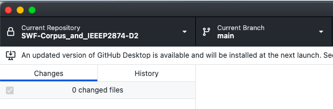
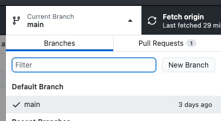
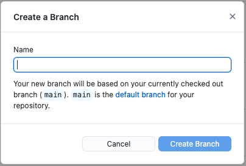

= How to Contribute to this GitHub Repository using Branches on Main

. Install GitHub Desktop, an AsciiDoc editor and clone the repo (Main) to your local disk. There are many tutorials on the Web for how to do these steps.
. With GitHub Desktop open, make sure you are in Main Branch

[arabic, start=3]
. Open the pop-up

[arabic, start=4]
. Choose New Branch

[arabic, start=5]
. Give your New Branch a Name using this convention: initials.purpose of the branch (update to…)
. Then go back to GitHub Desktop and make sure you are using that branch (select the branch you just created above)

image:images/image4.png[image,width=474,height=297]

[arabic, start=7]
. Open your AsciiDoc editor
. Navigate to and open the project files from your local clone (on your hard disk)
. Make edits to the file, locally
. When you save a file go back to GitHub Desktop and make a short note in bottom left about the edit (e.g., added text, edited etc)
. Continue and repeat with one or more .adoc files
. Go back to GitHub Desktop and Publish the New Branch
