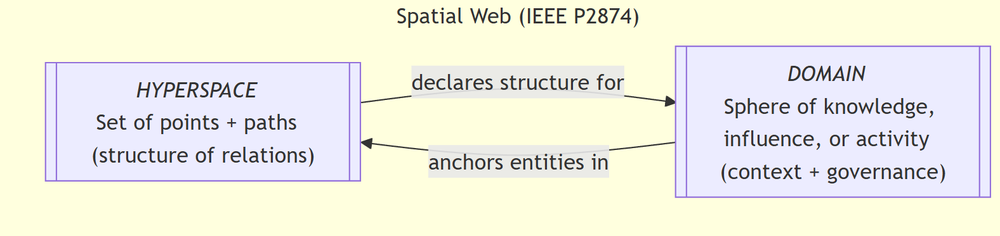

== Introduction

This document specifies the Hyperspace Modeling Language (HSML) Implementation Specification,  
a core component of the IEEE P2874 Spatial Web Standard. HSML provides the semantic backbone  
for representing **entities, domains, activities, channels, tools, and digital twins** in a unified framework.  
It is both human- and machine-readable, designed to ensure semantic precision, governance, and  
interoperability at web scale.

As envisioned in IEEE P2874/D3.3.2, the Spatial Web is a globally interoperable socio-technical fabric  
connecting humans, autonomous systems, and the Internet of Things (IoT). Its purpose is to integrate  
the digital and physical worlds into a **shared semantic fabric** where information is contextual,  
interactions are secure, and governance is intrinsic. Realizing this vision requires a data model capable of:

* representing complex, compositional systems;
* supporting automated activities and contracts; 
* embedding governance and credentialing; 
* enabling explainability and compliance across diverse domains.

HSML fulfills this role by defining a **normative ontology and modeling language** for the Spatial Web.  
It specifies how entities are identified, how domains declare spatial structure (via hyperspaces), and how  
activities, permissions, and governance rules are semantically represented. HSML does not itself provide  
query or transaction mechanisms; these are addressed by complementary specifications such as the  
**Hyperspace Query Language (HSQL)** and the **Hyperspace Transaction Protocol (HSTP)**.  
Instead, HSML forms the semantic layer upon which those protocols depend.

[IMPORTANT]  
====  
IEEE P2874/D3.3.2 is an approved draft of a proposed IEEE Standard and remains subject to change.  
This HSML Implementation Specification has been developed to meet the Implementation Specification  
requirements defined within the IEEE P2874 Draft Standard.  
====

=== Background and Motivation

The Spatial Web is built on an integrated framework of **protocol, architecture, and governance**,  
embodied in the Hyperspace Transaction Protocol (HSTP) and the Hyperspace Modeling Language (HSML).  
Together these provide the foundation for a **globally interoperable system of systems**, defining how  
entities are modeled, how transactions are conducted, and how governance is embedded at every layer.  
IEEE P2874 unifies these elements into a reference model for Spatial Web components, systems, and services.

At the core of this foundation is the concept of *HYPERSPACE*. Formally, a hyperspace is a set of points  
where, for every ordered pair, there may exist a set of paths between them, plus an identity path for each  
point. This abstraction generalizes the notion of “space” beyond geography: points may represent entities,  
and paths may represent relationships, adjacencies, or transformations. Hyperspace enables the Spatial Web  
to merge the physical and virtual into a **shared semantic fabric** that transcends national and geographic  
boundaries. Entities that are physically distant may still be tightly coupled in other dimensions (e.g., logical,  
organizational, or contextual), allowing new forms of interaction, coordination, and governance.

Complementing *HYPERSPACE* is the concept of *DOMAIN*, defined as a “sphere of knowledge, influence,  
or activity.” Domains provide the semantic scaffolding of the Spatial Web: they anchor identifiable entities,  
declare the hyperspaces they inhabit, and establish rules of interaction (see <<fig-hyperspace-domain>>). Through shared and linkable domain  
architectures, HSML ensures that entities and their interrelationships can be consistently described,  
discovered, and governed across contexts.

[.text-center]
--
[[fig-hyperspace-domain]]
.Hyperspace and Domain in the Spatial Web

--

The development of the Spatial Web is driven by converging technological and societal forces, including:

* The increasingly **graph-like nature of global data**.  
* The opportunity for **automation and autonomic activities** enabled by context-aware AI.  
* The need for **composable and governable systems** spanning organizations and jurisdictions.  
* The requirement for **secure, verifiable transactions**.  
* The rise of **machine learning, neural computation, and edge intelligence**, demanding semantic integration.  
* The imperative for **explainable AI and robotic governance** to ensure trust and accountability.  
* The global proliferation of the **IoT and sensor meshes**, requiring scalable, standards-based models.  

Ultimately, the Spatial Web is conceived as a **socio-technical system of systems**. Its realization must  
address not only technical challenges of modeling, computation, and communication, but also the  
**social, cultural, ethical, and legal dimensions** of technology use. IEEE P2874 is therefore designed as  
a socio-technical standard, balancing technical infrastructure with governance frameworks to ensure a  
secure, interoperable, and human-centered digital-physical reality.

=== Relationship to IEEE P2874 (Spatial Web Foundation)

This HSML Implementation Specification is directly derived from and builds upon the IEEE P2874/D3.3.2 Draft Standard for Spatial Web Protocol, Architecture and Governance, dated March 2025. Material from the Spatial Web Foundation's "Spatial Web Protocol, Architecture and Governance," Version D3.3, copyright © 2025 Spatial Web Foundation, was used with permission as the base for this standard.

As a reference model, the IEEE P2874 standard establishes the set of required modules and sub-modules for Spatial Web-compliant implementations, along with their minimum functions and associated information models. It defines requirements for a set of Implementation Specifications, such as this HSML document, and identifies existing technologies and standards to be integrated into these implementations.

=== Goals and Benefits of HSML

The overarching purpose of the IEEE P2874 standard, and by extension this HSML Implementation Specification, is to provide a holistic and coherent technical framework for implementing a collaborative, interactive Spatial Web and shared world system. HSML is designed as a human- and machine-readable modeling language and semantic data ontology schema that describes objects, relations, actions, activities, and their permissions.

Specifically, HSML aims to achieve the following key goals:

* *Spatially Defined Digital Content Fulfillment*: Enable a functional layer stack capable of fulfilling spatially defined real-world and virtual requests for digital content while respecting governance authorities and self-sovereign identity.
* *Comprehensive Data Ontology*: Define a data ontology for describing objects, relationships, and activities, which is foundational for consistent data interpretation.
* *Verifiable Credentialing*: Specify a verifiable credentialing and certification method for permissioning create, retrieve, update, and delete access to devices, locations, users, and data.
* *Automated Contracting*: Support a **machine- and human-readable contracting language** that enables expression and automated execution of legal, financial, and physical commitments, tied to activities and governed by explicit norms and policies.
* *Shared Understanding*: Facilitate **semantic interoperability** between humans and AIs by ensuring that contextual meaning, intent, and activity outcomes are represented in a common HSML framework.
* *Explainable AI*:: Advance **AI transparency and accountability** by enabling explicit modeling of decision-making processes, conditions, and credentials required for activities.
* *Universal Interoperability*: Drive interoperability of models, data, and activities to enable **cross-domain collaboration** across organizations, networks, and geopolitical boundaries.
* *Compliance and Governance*: Provide the semantic hooks for ensuring compliance with **local, regional, national, and international** regulatory,  ethical, and cultural norms—while maintaining auditability through credential checks and policy evaluation.
* *Secure Identity and Authentication*: Ensure that **identity, privacy, authentication, and transparency** are embedded by design, contributing to robust verification of critical activities, agents, and data flows.

Together, these goals ensure that HSML delivers not just a data model, but a **governable, interoperable, and trustworthy foundation** for the Spatial Web—capable of unifying physical, digital, and agentic domains into a shared semantic fabric.