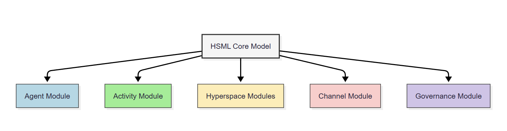

== Overview

This document provides a high-level overview of the Hyperspace Modeling Language (HSML) specification. HSML is the **semantic foundation of the Spatial Web**, enabling consistent representation of entities, domains, activities, spaces, and governance across distributed systems. It describes the modeling paradigm, guiding principles, modular structure, and formal extension mechanisms needed to support diverse domains while ensuring interoperability and compliance with IEEE P2874.

=== The HSML Modeling Paradigm

=== HSML Modeling Paradigm

The Spatial Web is founded on eight interdependent dimensions that, together, distinguish it from the conventional Semantic Web. HSML integrates these dimensions into a coherent modeling paradigm.

* *Entities:*
  The fundamental units of description in the Spatial Web. Every entity is globally identifiable by a Spatial Web Identifier (SWID) that conforms to W3C Decentralized Identifier (DID) syntax. Unlike Linked Data URIs, which depend on centralized DNS resolution, SWIDs are cryptographically verifiable, self-sovereign, and portable across networks. This guarantees persistence of reference and enables interoperable interactions across distributed systems.

* *Domains:*
  A specialized kind of entity that functions as a holon — a self-contained whole that is also part of larger systems. A domain defines a “sphere of knowledge, influence, or activity” in which governance rules apply. Examples include agents, persons, organizations, places, and things. Domains carry identity, enforce norms, and govern activities within their scope. Domains naturally form **holarchies**, where they can be linked through ad hoc memberships, component-of relations, or aggregation into more complex structures.

* *Hyperspace:*
  The structural layer that defines how entities in a domain relate spatially or structurally. Hyperspaces generalize the notion of “space” beyond geography, encompassing topological, metric, vector, cellular, or graph-based structures. A domain may be bound to one or more hyperspaces, which define adjacency, connectivity, and distance among its entities. This allows HSML to uniformly represent physical, logical, and abstract spatial structures.

* *Semantics:*
  Every element and relationship in HSML has a well-defined, machine-readable meaning. By adopting RDF, OWL, and SHACL, HSML ensures that data is not just syntactically structured but also contextually understood. This enables reasoning, validation, and interoperability across heterogeneous systems. Semantics provide the interpretive layer that makes entities discoverable, explainable, and governable.

* *Distributed Graph Structure:*
  The Spatial Web is organized as a **distributed semantic hypergraph**. Entities and domains form the nodes, and their relationships form semantically typed edges (e.g., `isLocatedAt`, `isOwnedBy`, `performsActivity`). This distributed graph spans multiple domains and infrastructures, enabling global interconnection without centralized control. The hypergraph model supports complex, multi-dimensional queries and compositional reasoning across contexts.

* *Identity and Trust:*
  Trust is not an external service but intrinsic to the model. Every entity’s SWID is a DID, which anchors it in a decentralized identity framework. Verifiable Credentials (VCs) provide attestations about entities or domains, while Zero-Knowledge Proofs (ZKPs) allow selective disclosure of credentials for privacy-preserving validation. This creates a **built-in trust layer**, ensuring authentication, authorization, and provenance are verifiable across domains without reliance on centralized authorities.

* *Activities:*
  Activities are first-class entities that capture dynamic processes and state changes. They can be defined abstractly as schemas (with pre- and post-conditions) or realized as specific instances with execution states. Activities link agents, tools, and things, providing the means by which goals are pursued and domains interact. Modeling activities explicitly makes the Spatial Web executable, supporting workflows, coordination, and monitoring.

* *Governance:*
  The Spatial Web is not only technical but also social and ethical. Governance encompasses the rules, norms, contracts, and policies that domains declare and enforce. Governance by design ensures that interactions are not merely possible but accountable, lawful, and ethical. HSML provides formal hooks for embedding governance into domains, so that compliance, trust, and fairness are enforced natively rather than retrofitted.

=== Design Principles for HSML Implementation

The implementation of HSML is guided by design principles that ensure the specification is robust, adaptable, and widely reusable. These principles extend the modeling paradigm into practical rules for ontology engineering and system interoperability.

* *Composability:*
  HSML models are built from smaller, reusable units. Domains, activities, and hyperspaces are defined as modular components that can be assembled into larger systems. This allows complex applications to be constructed dynamically from standardized parts without redundancy.

* *Interoperability:*
  HSML provides a shared semantic layer that ensures systems developed by different organizations can interact without ambiguity. Interoperability extends beyond syntax to include identity, provenance, and trust by binding every entity to a SWID/DID.

* *Leverage Existing Standards:*
  HSML reuses existing standards wherever possible (RDF, OWL, SHACL, W3C DID/VC, GeoSPARQL, WoT, SAREF). By aligning with mature specifications, HSML avoids reinvention, accelerates adoption, and maintains compatibility with broader ecosystems.

* *Extensibility:*
  HSML anticipates evolving needs. Formal mechanisms such as *profiles*, *custom schemas*, and *module extensions* allow new data types, relationships, and governance models to be introduced without breaking backward compatibility. This ensures adaptability across industries and use cases.

* *Modularity and Minimal Ontological Commitment:*
  HSML is structured into **independent modules**, each addressing a specific functional concern (e.g., Agents, Activities, Hyperspaces, Channels, Governance). Each module makes only the minimal ontological commitments necessary for interoperability, avoiding prescriptive domain-specific assumptions. This maximizes flexibility, lowers barriers to adoption, and supports **plug-and-play reusability**.

* *Governance by Design:*
  Governance is intrinsic to the model, not an external layer. Domains can declare rules, norms, contracts, and policies as part of their identity and scope. This ensures compliance, accountability, and fairness are enforceable at the semantic level.

* *Decentralized Trust by Design:*
  Trust is anchored in decentralized identifiers (DIDs), verifiable credentials (VCs), and zero-knowledge proofs (ZKPs). This creates a built-in trust fabric where identity, authentication, and authorization are portable and verifiable across domains, without reliance on centralized authorities.

* *Holonic Organization:*
  Domains act as holons, enabling both autonomy and integration. Holarchies allow domains to be nested or linked in multiple ways — through membership, composition, or aggregation — ensuring scalability and resilience in distributed environments.

* *Separation of Concerns:*
  HSML distinguishes clearly between **entities** (what exists), **hyperspaces** (how things relate), **activities** (what happens), and **governance** (how things are regulated). This modularity ensures each dimension can evolve independently while remaining semantically aligned.

* *Validation and Assurance:*
  HSML employs SHACL shapes and OWL constraints to enforce structural and semantic consistency. Validation is a first-class concern, guaranteeing that data exchanged across domains is coherent, trustworthy, and policy-compliant.

* *Explainability and Reasoning:*
  HSML ensures that all relationships are explicit and machine-interpretable, enabling semantic reasoning and explainable AI. Agents and systems can not only act but also justify their actions against declared norms, goals, and rules, supporting transparency and accountability.

=== Core Model and Modules

To manage complexity and support broad adoption, the HSML specification is organized into a **Core Model** and a set of **modular extensions**. This modular design ensures maximum reusability with minimal ontological commitment, allowing implementers to adopt only the components relevant to their application while maintaining interoperability across the Spatial Web.

* *Core Model:*
  The Core Model defines the most fundamental and universal constructs of HSML. It establishes:
  ** *Entity* – the universal superclass for all things in the Spatial Web, each identified by a Spatial Web Identifier (SWID/DID).
  ** *Domain* – a specialized kind of entity functioning as a holon, encapsulating identity, governance, and scope.
  ** *Foundational relationships* – common properties for identity, membership, composition, and linkage across entities and domains.
  The Core Model is the **semantic foundation** upon which all other modules are built.

* *Modules:*
  Building on the Core Model, HSML defines a set of modules that introduce specialized constructs for particular functional areas. Each module adds only the minimum commitments necessary to support its scope, ensuring extensibility and reuse:
  ** *Agent Module* – defines persons, organizations, and autonomous systems as domains with agency, goals, and capabilities.
  ** *Activity Module* – defines structured processes, schemas, instances, and execution lifecycles that domains can perform.
** *Hyperspace Module* – defines the spatial and structural contexts where entities relate.
     – The Hyperspace Module is itself **composed of submodules** for different space types: *Topological Space*, *Metric Space*, *Vector Space*, *Cellular Space*, *Graph Space*, and *Datatype Space*.
  ** *Channel Module* – defines transient groupings of entities and data streams bound to activities for communication and coordination.
  ** *Governance Module* – defines credentials, contracts, norms, and policies that domains declare and enforce.

This modular architecture enables **plug-and-play deployment**: implementers can select the subset of modules required for their application, while remaining compatible with the broader HSML ecosystem and the IEEE P2874 Spatial Web standard (see <<fig-hsml-core-modules>>).

[.text-center]
--
[[fig-hsml-core-modules]]
.HSML Core Model and Modules with Hyperspace Submodules

--

=== Extension Mechanisms

Recognizing that no single specification can anticipate all future needs, HSML provides formal mechanisms for extension. These ensure that the language can evolve and adapt to new technologies, industries, and governance requirements without breaking compatibility with the Core Model.

* *Profiles:*
A profile is a curated collection of HSML modules, constraints, and optional extensions tailored for a particular application or industry. Profiles act as **vertical specializations** while remaining grounded in the common HSML core.
** Example: A *Smart Mobility Profile* may combine the Agent, Activity, and Hyperspace modules with a custom *Transportation* schema to support autonomous vehicle networks.
** Example: A *Digital Health Profile* may combine the Governance module with domain-specific ontologies for medical credentials, ensuring trust and compliance.
Profiles promote interoperability by establishing shared constraints within a sector, while still ensuring cross-domain compatibility through the HSML foundation.

* *Custom Schemas:*
For more granular or domain-specific needs, developers may define custom schemas by reusing Semantic Web standards:
** *OWL 2* for declaring new types of entities, domains, properties, and relationships.
** *SHACL* for defining constraints, validation rules, and profiles that data instances must satisfy.
** *RDF-star and SHACL rules* for expressing richer link types (e.g., weighted, temporal, or probabilistic edges).
These schemas can be registered, published, and shared across domains, allowing the Spatial Web ontology to **grow organically while preserving coherence**.

* *Hyperspace Extensions:*
The Hyperspace Module is intentionally **open-ended**. In addition to its current submodules (*Topological*, *Metric*, *Vector*, *Cellular*, *Graph*, and *Datatype Spaces*), P2874 anticipates other space types that can be added as extensions. Examples include:
** *Probabilistic Spaces* – where paths carry uncertainty or probability weights, supporting stochastic modeling.
** *State-Machine Spaces* – where points represent states and paths represent transitions, aligning with process or workflow modeling.
** *Observation/Data-Cube Spaces* – treating multi-dimensional data (e.g., sensor arrays, statistical cubes) as hyperspaces.
** *Quantum or Hilbert Spaces* – supporting future quantum computation or simulation domains.
New types can be introduced simply by declaring subclasses of `hsml:Hyperspace`, ensuring extensibility without changes to the Core Model.

* *Governance Extensions:*
Governance models vary across cultures and industries. HSML allows the definition of new contract forms, policy languages, and credential profiles. For example, a financial domain might introduce a *RegulatoryComplianceProfile* requiring specific verifiable credentials, while a social domain might define an *EthicsProfile* for AI agent behavior.

* *Modularity and Minimal Commitment:*
All extensions follow the principle of **minimal ontological commitment**. Modules and schemas introduce only the constructs strictly necessary for their scope, ensuring that extensions remain lightweight, reusable, and composable. This preserves interoperability across domains and minimizes barriers to adoption.

This extension framework ensures that HSML can evolve alongside the Spatial Web: supporting innovation while maintaining stability, trust, and semantic coherence.
